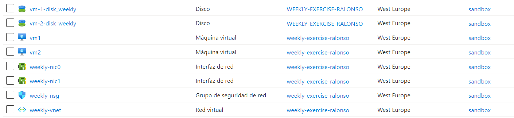

# Creación del blanceador de carga y recursos necesarios

Este workload hace uso del módulo que se ha creado en el repositorio de ejercicios para crear un balanceador de carga y los recursos de red necesarios para su funcionamiento. Debido a un problema con las credenciales del service principal no se ejecuta con las acciones de GitHub Acctions, sin embargo, puede verse que todos los reccursos necesarios se crean al hacer uso del módulo de manera manual.

Recursos que crea el módulo:




Como resultado de esto, al acceder a la IP Pública del balanceador de carga nos aparecerá un mensaje de la mv a la que nos está redireccionando: 


La información necesaria para ejecutar este módulo se proporciona a través de una única variable:

```
variable "azure_infrastructure" {
  description = "Details of the Azure infrastructure."
  type = object({
    load_balancer_name     = string
    resource_group         = object({
      name     = string
      location = string
    })
    virtual_network        = object({
      name           = string
      address_space  = list(string)
    })
    subnet                 = object({
      name              = string
      address_prefixes  = list(string)
    })
    network_security_group = object({
      nsg_name       = string
      security_rules = list(object({
        name                       = string
        priority                   = number
        direction                  = string
        access                     = string
        protocol                   = string
        source_port_range          = string
        destination_port_range     = string
        source_address_prefix      = string
        destination_address_prefix = string
      }))
    })
    public_ip_name         = string
    network_interface_name = string
    vms                    = list(object({
      name                = string
      size                = string
      admin_username      = string
      disk_name           = string
      redundancy_type     = string
    }))
  })
  default = {
    load_balancer_name     = "lb-weekly-default"
    resource_group         = {
      name     = "weekly-exercise-ralonso-default"
      location = "westeurope-default"
    }
    virtual_network        = {
      name           = "weekly-vnet-default"
      address_space  = ["10.0.0.0/16"]
    }
    subnet                 = {
      name              = "weekly-subnet"
      address_prefixes  = ["10.0.1.0/24"]
    }
    network_security_group = {
      nsg_name       = "weekly-nsg-default"
      security_rules = [
        {
          name                       = "web"
          priority                   = 1008
          direction                  = "Inbound"
          access                     = "Allow"
          protocol                   = "Tcp"
          source_port_range          = "*"
          destination_port_range     = "80"
          source_address_prefix      = "*"
          destination_address_prefix = "*"
        }
      ]
    }
    public_ip_name         = "lb-weekly-public-ip-default"
    network_interface_name = "weekly-nic-default"
    vms                    = [
      {
        name            = "vm1"
        size            = "Standard_F2"
        admin_username  = "adminuser"
        disk_name       = "vm-1-disk_weekly"
        redundancy_type = "Standard_LRS"
      },
      {
        name            = "vm2"
        size            = "Standard_F2"
        admin_username  = "adminuser"
        disk_name       = "vm-2-disk_weekly"
        redundancy_type = "Standard_LRS"
      }
    ]
  }
}

```